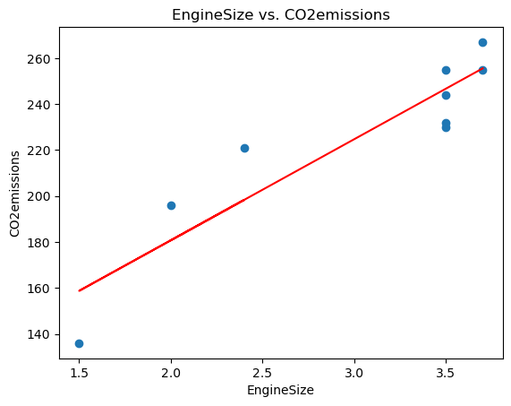

<h1>Ordinary Least Squares and Normal Equations to Estimate Linear Regression Coefficients/Parameters</h1>

Estimating the parameters of simple and multiple linear regression using Ordinary Least Squares (OLS) and Normal Equations

  Medium blogpost: https://medium.com/@jairiidriss/ordinary-least-squares-and-normal-equations-in-linear-regression-85af6ccc5bf5

